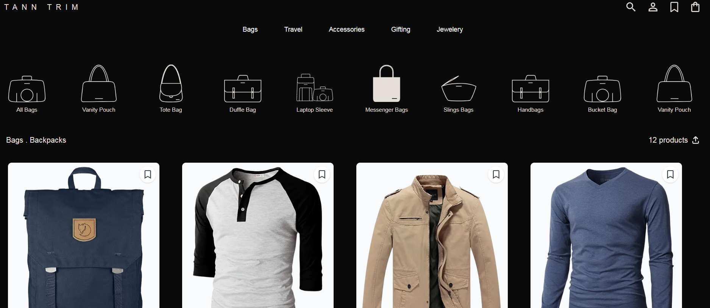
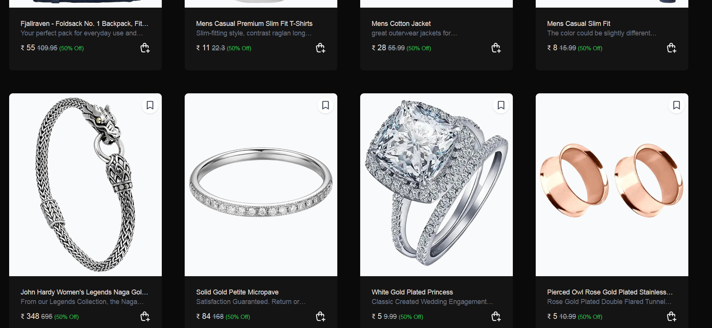

# Bags Website

A responsive e-commerce platform showcasing a curated collection of bags, backpacks, and accessories. Built with React, Axios, and Tailwind CSS, this project offers a seamless shopping experience across devices.

🔗 Live Demo: [bagswebsite.netlify.app](https://bagswebsite.netlify.app/)

---

## 🛠️ Features

- **Dynamic Product Display**: Fetches product data from the [Fake Store API](https://fakestoreapi.com/products) and displays up to 12 items per page.
- **Responsive Design**: Optimized for mobile, tablet, and desktop views using Tailwind CSS.
- **Pagination**: Navigate through product pages with a user-friendly interface.
- **Interactive UI**: Includes features like adding items to the cart and viewing product details.

---

## 📸 Screenshots


*Browse a variety of bags and accessories.*


*View detailed information about each product.*


---

## ⚙️ Tech Stack

- **Frontend**: React, Tailwind CSS
- **State Management**: React's useState and useEffect hooks
- **API**: Axios for data fetching
- **Deployment**: Netlify

---

## 🚀 Getting Started

To run this project locally:

1. Clone the repository:
   ```bash
   git clone https://github.com/shaaluk/bags-website.git
   cd bags-website
